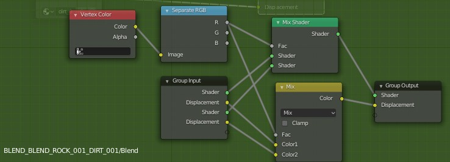
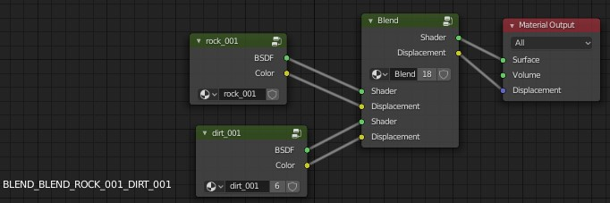

# Yet Another VMF Converter
A simple converter for basic map geometry of VMF files.

## Shortcomings + Benefits
* Only processes solids, but no entities, decals, overlays, etc., i.e. only the very basic map geometry.
* Maps displacements' alpha values to the red vertex color channel, allowing texture blending using that channel.
* It's fast.

## Blender Helpers

### UVMap/Vertex Color Channel names
As each solid is its own mesh (or more if the sides have different materials), you eventually want to join most generated meshes into larger ones.
But as each uv map and vertex color channel is assigned a unique name, merging these objects will fail.
To allow lossless merging of meshes, run this script first to give all channels of the selected objects the same name, which allows Blender to merge them properly.

```python
import bpy

for obj in bpy.context.selected_objects :
    for uvmap in obj.data.uv_layers:
        uvmap.name = "UVMap"
    layer, *_ = obj.data.vertex_colors.values()
    layer.name = "VCol"
```

### Blender Texture Blending
To properly use "texture blending" using the provided displacement alpha data, first set up a group for blending different materials like this.



Then use it like this (note that the source shaders are grouped, because they are used without blending in other materials, which allows changing parameters by just editing the group).



### Entity Placement

Use [this included blender script](./blender/operator_file_import_yavc.py) to create empties in your blender file for every `prop_static` and `prop_dynamic` entity.
These empties are named according to the referenced models and their assigned skins, they have their viewport colors set to their render colors (allowing rgb mixing for rendering), and they are prepared for collection instancing (i.e., you only need to insert the correct collection containing the appropriate model). 